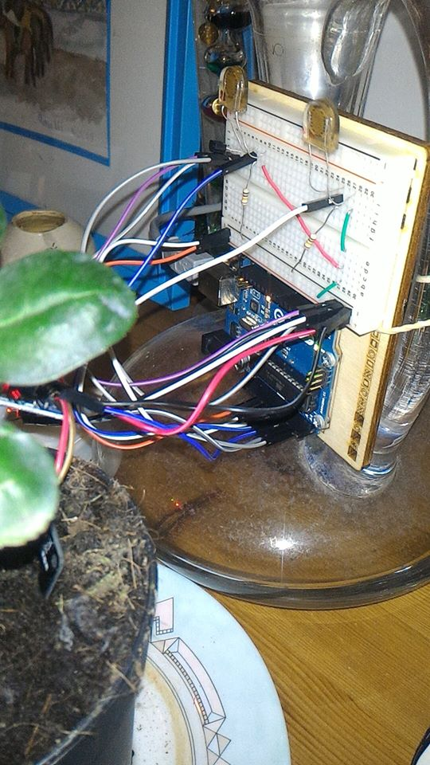
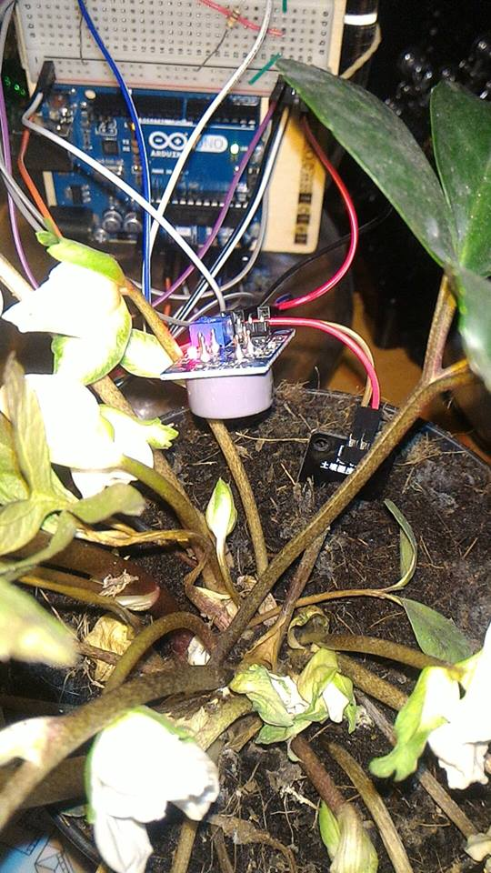
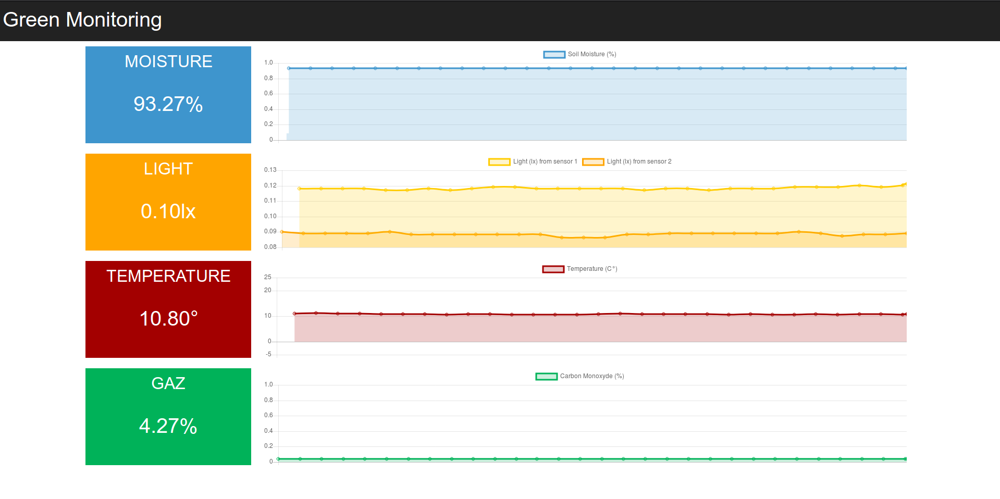
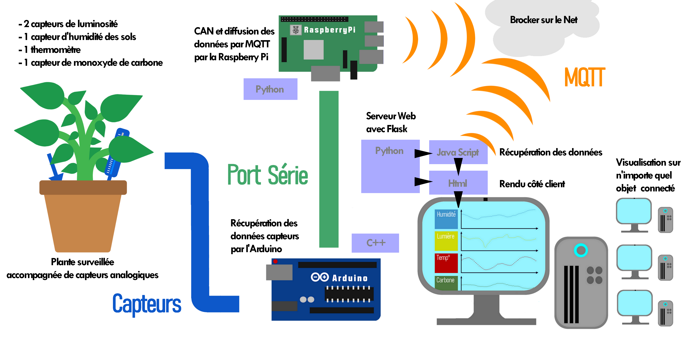

 

## Description du système
Le système de monitoring est constitué de plusieurs capteurs, deux capteurs de luminosité, un capteur de monoxyde de carbone, un capteur de température et un capteur d'humidité. L'ensemble de ces capteurs est disposé autour et dans le pot de la plante et relié à un arduino afin de réaliser les différentes mesures, puis celles-ci sont émises via le protocole MQTT qui se charge de diffuser les informations.
Un serveur va se charger de récupérer les informations émises et de les rendre accessibles les différentes mesures depuis internet. Il est possible d'observer les constantes de la plante via l'évolution de différentes courbes.

## Avantages / Inconvénients / Limites
Grâce au protocole MQTT, il est facile de rajouter d'autres capteurs et de communiquer leurs données de plus la mise en place d'un tel système est peu coûteux. Le serveur nous permet d'accéder en temps réel et de n'importe où aux constantes de la plante.
Cependant, les capteurs utilisés sont peu précis et le dispositif une fois installé ne relève pas d'une oeuvre d'art.

## Utilisation
Pour commencer, il faut tout d'abord téléverser le code .ino sur une carte arduino et de connecter l'ensemble des composants. Ensuite, depuis une raspberry lancer le programme python serial_to_mqtt.py situé dans le src.
Il reste plus qu'à lancer le serveur, pour cela il est possible de l'exécuter en local en lançant le programme python app.py situé dans webapp ou en ligne en exportant les dossiers static et templates sur l'hébergeur de votre site web.

## Photo du système

## Schéma complet du système
 

## Ressources 
<!-- ##### Capteur de monoxyde de carbonne  -->
[Capteur de monoxyde de carbonne 1](http://www.knight-of-pi.org/digital-sensors-and-the-raspberry-pi-with-the-smoke-detector-mq-x-as-example/)
[Capteur de monoxyde de carbonne 2](http://untitled.es/sensor-gas-mq7-raspberry-pi2/) 
<!-- ##### Capteur de luminosité -->
[Capteur de luminosité](https://pimylifeup.com/raspberry-pi-light-sensor/) 
<!-- ##### Capteur d'humidité -->
[Capteur d'humidité](https://www.instructables.com/id/Soil-Moisture-Sensor-Raspberry-Pi/)
